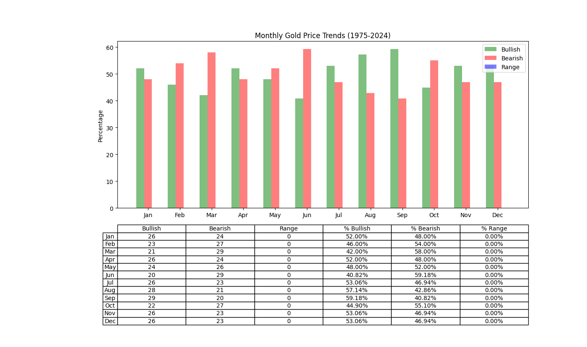

# Gold Trend

## Overview
Gold Trend is a project designed to analyze and predict trends in gold prices. It uses various data science techniques to provide insights and forecasts that can help investors and analysts in their decision-making process.


## Installation

To get started with Gold Trend, follow these steps:

1. Clone the repository:
   ```bash
   git clone https://github.com/fathfx/gold-trend/
   cd gold-trend
   ```

2. Install the required dependencies:
   ```bash
   pip3 install -r requirements.txt
   ```

3. Run the application:
   ```bash
   python3 main.py
   ```

## Usage

After installation, you can run the `main.py` script to start the analysis. The script will output predictions and visualizations related to gold price trends.

## License

This project is licensed under the MIT License - see the [LICENSE](LICENSE) file for details.
